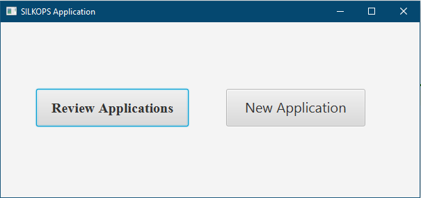
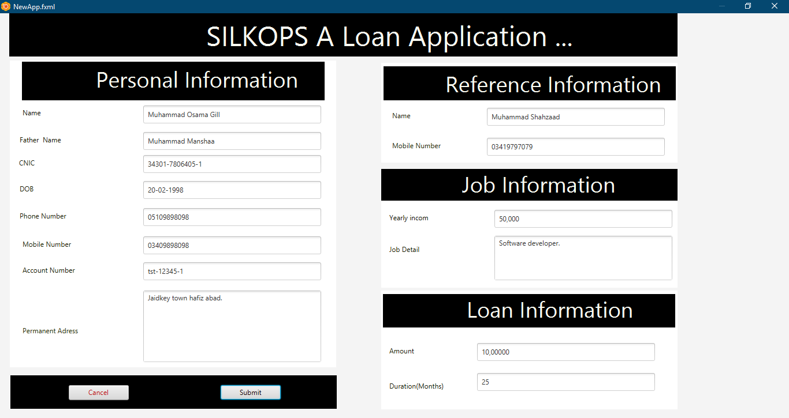
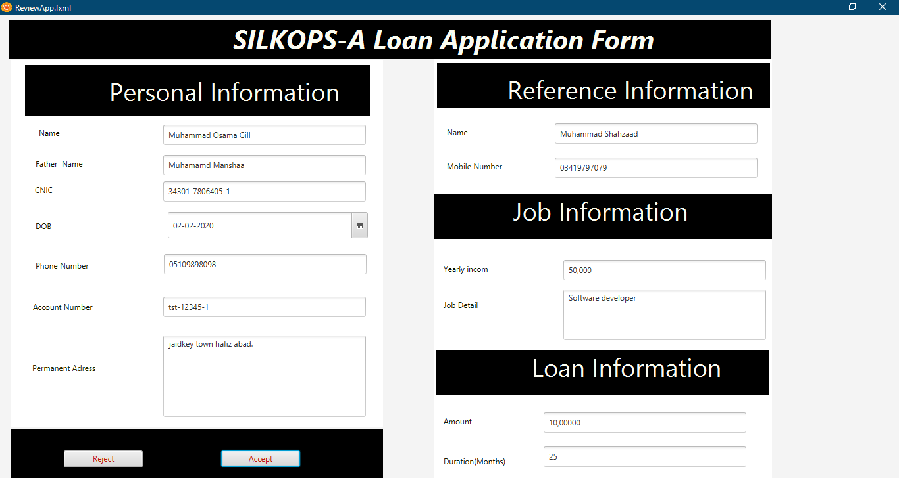

# SILKOPS
SILKOPS is a bank Loan Application, build in Java FX for GUI, JDBC, mySQL and Java language. 
<h3>Features</h3>
<ul>
<li>User Can Apply for loan.</li>
<li>Bank manager Can Review Application and can accept and reject loan application.</li>
<li>Acception OR rejection status will emiled to applicent.</li>
</ul>

<h3>Screenshots</h3>

<h2>Home</h2>

<h2>New Applicaion Form</h2>

<h2>Review Appliction and Accept OR reject loan Application.</h2>

